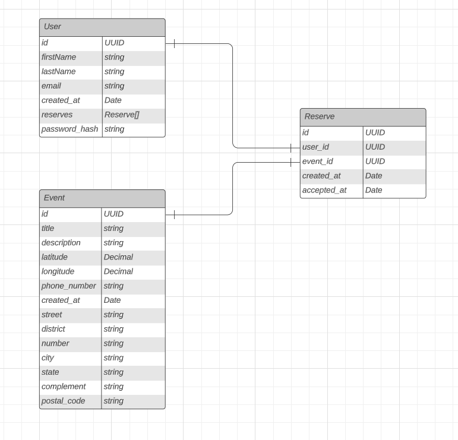

# EVENT FINDER
Find the nearest event based on your current location using Event Finder.

## About Project
This project is created with the intention of study backend concepts and learn about organization and documentation.
Since i´m attending some presencial events i had this idea: "Create an app where the person can find a event nearby and filter by range."

## Technologies
- NodeJS 18.x
- Typescript
- Prisma
- Fastify
- Vitest

## How to run

### 1 - Docker

- Install Docker through docker [website](https://www.docker.com)
- After installing, open project terminal and run the following command to create the container with the database:
  ```
    docker-compose up
  ```

### 2 - Prisma

- After installing docker and run the container, the next step is setup the database.
- Since the migrations are already on project you can just run the prisma command to create the tables:
  ```
    npx prisma migrate dev
  ```

### 3 - Running the service

- After completing the previous steps you can run the command:
  ```bash
    npm run start:dev
    or
    yarn start:dev
  ```

## Postman Collection

- SOON!

## Technical Documentation

This part of our readme will tell a little more about of database structuring and some decisions, but in future i will try to create more specific explaining each of my decisions.

### 1 - Database structuring

- The idea of the project is being simple and objective, i know the idea can become much more complex but the in this case i wanted to start with a simple step.
- Since it has been told, i'm trying to fill some gaps of knowledge i have in my formation, and one of those gaps is: structuring a database.
- I know my structuring in this project will not be perfect, but i´m trying to improve while i continue studying the theme on other online courses.
- This is the ER Diagram of my database:


- The major idea here was, i need to register a user, a event and make a reservation.
- I tried to keep it without creating a lot of fields, i tried to keep it simple and small, only using the necessary.

### 2 - Routes Documentation

- SOON!